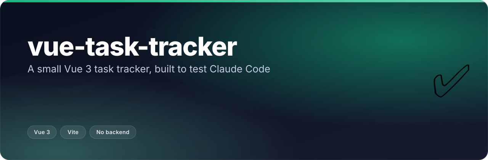
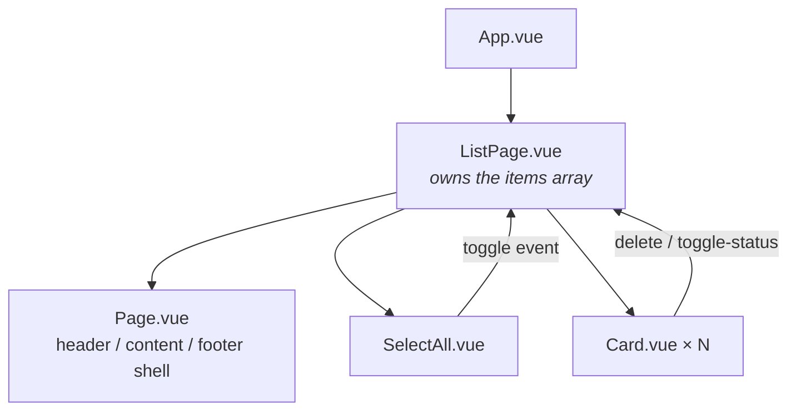
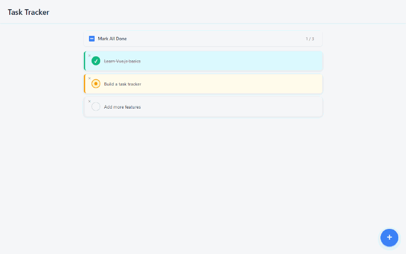
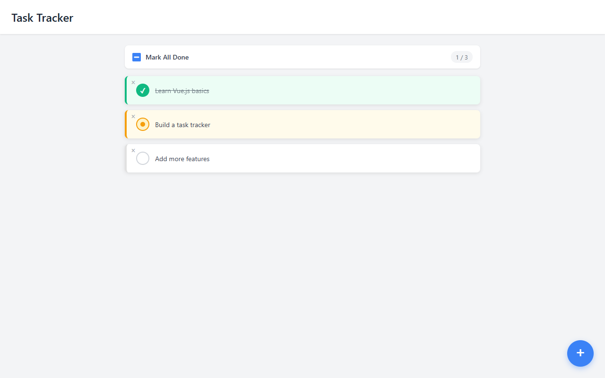
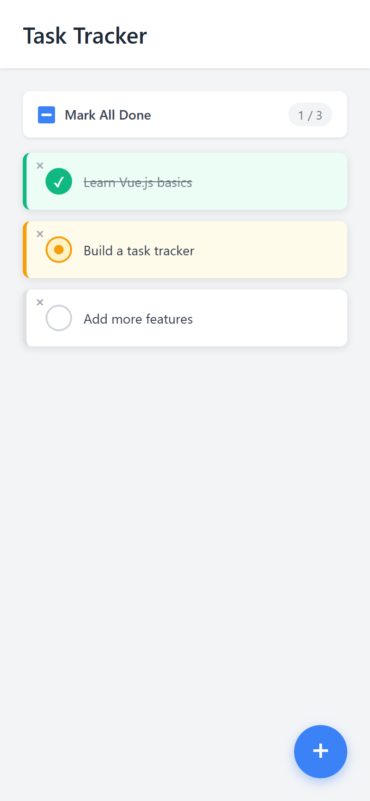

<p align="center"></p>

<p align="center">
  <b>A pocket-sized Vue 3 task list — three components, no backend, no persistence, one sitting.</b>
</p>

<p align="center">
  
  
  
</p>

## 🧪 What it is

This is a small **test repo** — a task tracker built in Vue 3 to see what Claude Code could
scaffold end-to-end in one session. It is not a product and has no ambitions to become one;
treat it as a worked example of a clean, componentised Vue app rather than a tool to adopt.

What actually works, reading straight from the code:

- **Add** a task with the floating `+` button — it appears already in edit mode with its
  placeholder text selected, ready to type over.
- **Rename** any task by double-clicking its text.
- **Cycle status** by clicking the round status dot: `pending → in-progress → done`, each with
  its own card colour and left border; `done` also strikes the text through.
- **Bulk-toggle** every task with the "Mark All Done" checkbox, which shows an indeterminate
  state (a dash) when only some tasks are done.
- **Delete** a task with the small `×` in its top-left corner.
- Adding and removing tasks animate in/out via Vue's `<TransitionGroup>` (slide + fade).

There is **no backend, no router, no store, and no persistence** — task state lives in a single
`data()` object in `ListPage.vue` and resets to the three seed tasks on every page reload.
There are also no automated tests and no CI.



Props flow down from `ListPage.vue` to its children; every child emits events back up
(`toggle`, `delete`, `toggle-status`) instead of mutating state itself — standard Vue one-way
data flow, kept deliberately simple.

## 🎬 See it

<p align="center"></p>

<table><tr>
<td width="50%"><br><sub>Desktop — 1280px, the three seed tasks</sub></td>
<td width="50%"><br><sub>Mobile — 390px (iPhone viewport)</sub></td>
</tr></table>

## 🚀 Run it

```bash
npm install
npm run dev      # Vite dev server — http://localhost:5173
npm run build    # production build → dist/
npm run preview  # preview the production build
```

No environment variables, no API keys, no database — it's a static single-page app.

## 🗂️ Layout

```
claude-code-test/
├── index.html            # Vite entry point, mounts #app
├── vite.config.js        # @vitejs/plugin-vue, nothing else
└── src/
    ├── main.js           # createApp(App).mount('#app')
    ├── App.vue           # renders <ListPage />
    ├── pages/
    │   └── ListPage.vue  # owns task state + every handler
    └── components/
        ├── Page.vue      # layout shell (header/content/footer slots)
        ├── Card.vue      # one task: status dot, delete button, slot
        └── SelectAll.vue # "mark all done" checkbox + n/total count
```

Stack is Vue 3 (Options API) on Vite 5, styled with plain scoped `<style>` blocks per
component — no CSS framework, no state library, nothing beyond what a task list needs.

---

<p align="center"><sub>Built by <a href="https://github.com/ChinmayGit8765">Chinmay</a> · part of the <a href="https://chinmaygit8765.github.io/exaryn-studio/">Exaryn</a> studio</sub></p>
